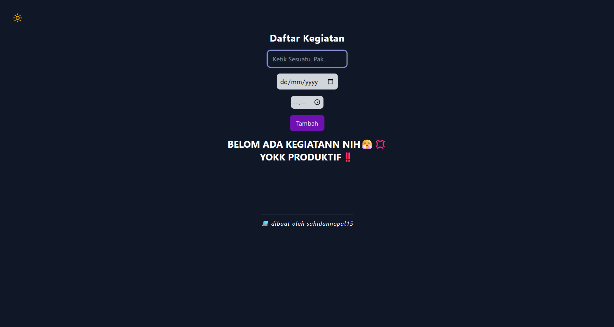
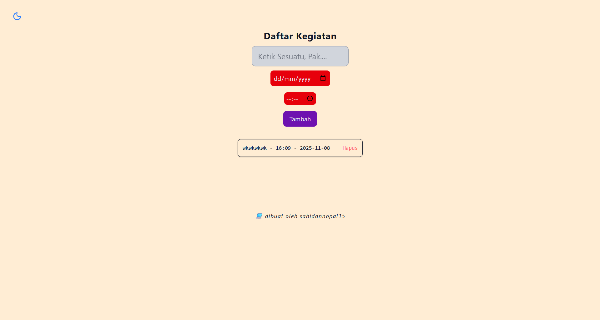

<h3>📋To-do List app

<h5>aplikasi berbasis React + Tailwind CSS yang mensimulasikan user untuk mencatat kegiatan yg akan dikerjakan.

<h4>⚙️ Fitur : 
<h5>💻📱Tampilan responsive - bisa digunakan di laptop maupun handphone.
<h5>😎Mengubah Tema -  user bisa mengubah tema seperti gelap ke terang dan sebaliknya.
<h5>⌛Menerima input - user bisa memasukan kegiatan yg akan dilakukan.
<h5>🕰️menyesuaikan waktu ketika menginput - user bisa mnegatur waktu kegiatan.
<h5>📋Mendapat output - user akan menerima output berupa ringkasan kegiatan dan waktu.

<h4> 🧩 Teknologi yang Digunakan :
<h5>⚛️ React.js — untuk membangun antarmuka pengguna
<h5>💨 Tailwind CSS — untuk styling cepat dan responsif

🎬 Tampilan : 

<h3> Terimakasih sudah membaca 😁
